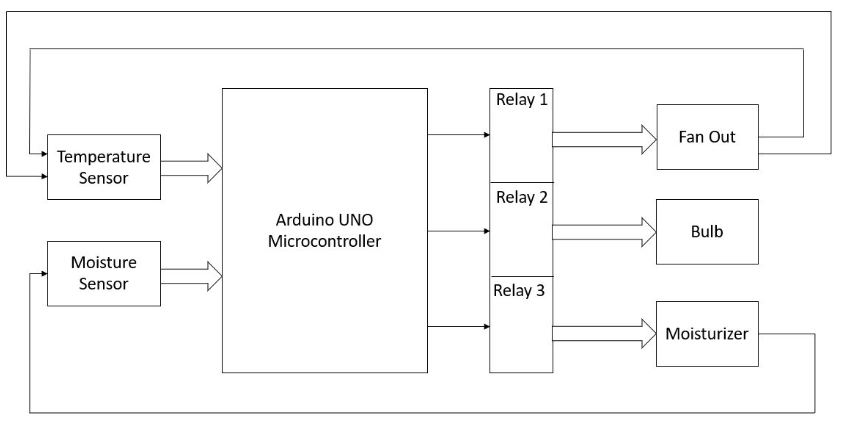

# Miniature Greenhouse
## <b> Project Electronics Intrumentation - ES 641 </b>

Miniature greenhouse can be used to keep small plants in your house, even in areas with extreme temperatures. This prototype of a miniature Greenhouse continuously measures and displays Temperature and Humidity inside the Greenhouse and also controls these factors using a tungsten bulb (heat source) to increase temperature and a fan to reduce humidity and throw out heat as well.

This repository contains the code for the Miniature Greenhouse project. The project is a part of the course Electronics Intrumentation (ES 641) at IIT Gandhinagar. Please load the DHT11 library before running the code.

Thank you